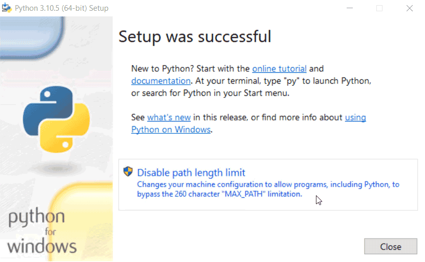

# Installation

```{contents} Contents
:depth: 3
```

```{attention}
NICE Toolbox requires [third-party dependencies](https://github.com/OSLabTools/nicetoolbox/blob/main/Makefile) during installation. These are not maintained by the NICE Toolbox authors and are provided as-is by their respective owners. We assume no liability for any issues arising from these dependencies. **Use at your own risk**. For more information, see [the Section 5 of the NICE Toolbox License](https://github.com/OSLabTools/nicetoolbox/blob/main/LICENSE.md). 
```

## System Requirements

| Component | Requirement |
|-----------|-------------|
| **OS** | Windows 11 or Ubuntu 22.04+ |
| **RAM** | 32 GB or more |
| **GPU** | NVIDIA GPU with 24 GB VRAM or more, CUDA 11.8+ compatible |
| **Storage** | 80 GB SSD or more |

## Docker 

You can install NICE Toolbox using Docker. With Docker, you won't need to install dependencies manually as they are prepackaged into the Docker image.

To download and run the latest NICE Toolbox Docker image:

```shell
docker pull mpioslab/nicetoolbox
docker run --rm --gpus all -it mpioslab/nicetoolbox
```

It should start an interactive bash session inside a Docker container.  Follow [getting started](https://nicetoolbox.readthedocs.io/en/stable/getting_started.html) to enable a virtual environment and run detectors.

## Prerequisites

### Python 3.10

Please find the download links under the [official python](https://www.python.org/downloads/) pages. The latest installer of a stable release of Python 3.10.10 can be downloaded [from here](https://www.python.org/downloads/release/python-31011/).

If you are a Windows user, please add python to your `PATH` variable as explained on [educative.io](https://www.educative.io/answers/how-to-add-python-to-path-variable-in-windows).

For Windows users, we also recommend clicking **"Disable path length limit"** on the final screen of the Python installer. This removes the default 260-character path limit that can cause failures with long dataset or sequences names. 



You can always disable or enable line limit manually. See [Enable long path support](#on-windows-enable-long-path-support) for more details.

### Conda

We recommend installing Conda via [Miniforge](https://github.com/conda-forge/miniforge), which uses the open-source [conda-forge](https://conda-forge.org/) channel. Please follow the instructions on their [official website](https://github.com/conda-forge/miniforge).

If you installed Conda through Anaconda, you can switch to the free conda-forge channel following these steps:

```bash
# check what is currently set
conda config --show channels

# remove all channels other than conda-forge
conda config --remove channels defaults

# add conda-forge if not already present
conda config --add channels conda-forge
```

```{important}
During the installation of Conda, it is **crucial not to select** the option to register Conda's Python as the default Python interpreter.
This is because the Nice Toolbox requires **Python version 3.10** to be set as the default.


Selecting this option during installation may result in errors or conflicts, as Conda's Python version may differ from the required version for NiceToolbox. To ensure proper functionality, make sure Python 3.10 remains your default version.
```

```{important}
On Windows, after installing Conda, ensure that the Conda paths are added to the SYSTEM environment variables. See [here for more details](https://saturncloud.io/blog/solving-the-conda-command-not-recognized-issue-on-windows-10/#step-2-add-conda-to-the-path)
```

### Cuda 11.8

Please find installation instructions on the official websites: for [Windows](https://docs.nvidia.com/cuda/cuda-installation-guide-microsoft-windows/index.html) and [Linux Ubuntu](https://docs.nvidia.com/cuda/cuda-installation-guide-linux/index.html).


### FFmpeg

On Linux Ubuntu, please find detailed instructions [here](https://phoenixnap.com/kb/install-ffmpeg-ubuntu).

On Windows, you can follow [phoenixnap.com](https://phoenixnap.com/kb/ffmpeg-windows):

1. Visit the official [FFmpeg website](https://ffmpeg.org/download.html) to get the latest version
of the FFmpeg package and binary files.
2. Hover over the Windows icon with your mouse and click on 'Windows builds from gyan.dev'
3. This redirects you to a page having FFmpeg binaries. Install the latest git master branch build,
e.g., ffmpeg-git-essentials.7z.
4. Extract the downloaded files and rename the extracted folder as ffmpeg.
5. Move the folder to the root of the C drive or the folder of your choice.
6. Add FFmpeg to `PATH` in Windows SYSTEM environment variables.

### Git 

Ensure that Git is installed on your system. You can find installation instructions [here](https://git-scm.com/book/en/v2/Getting-Started-Installing-Git)

### On Windows: Microsoft Visual C++

Microsoft Visual C++ 14.0 or greater is required for compiling some of the dependencies. Get it with [Microsoft C++ Build Tools](https://visualstudio.microsoft.com/visual-cpp-build-tools/).

### On Windows: Make

Nice Toolbox uses Makefiles for simple installation process. Follow these steps to install `make` on Windows for use with **Git Bash**:

**Step 1:** Download `make` for Windows
- Go to the official **ezwinports** SourceForge page:  
   🔗 [https://sourceforge.net/projects/ezwinports/files/](https://sourceforge.net/projects/ezwinports/files/)
- Download the latest version of **make**:  
   - Look for a file named:  `make-<latest_version>-without-guile-w32-bin.zip`

**Step 2:** Extract the ZIP File
- Unzip the downloaded `make-<latest_version>-without-guile-w32-bin.zip` file.

**Step 3:** Copy the Files to Git Bash’s MinGW64 Folder
- Navigate to: `C:\Program Files\Git\mingw64`
- Copy the contents of the extracted folder (copy all folders) into `C:\Program Files\Git\mingw64`. 
- **IMPORTANT:** Do NOT overwrite or replace any existing files.

**Note:**  
After copying the files, you must **restart Git Bash** for the changes to take effect.


### On Windows: Enable long path support

We always recommend to enable long path support. If you did not click **"Disable path length limit"** during Python installation, you can enable long path support manually via **PowerShell** command line:

1. Search for **PowerShell** in the Start menu, right-click it and select **Run as administrator**.
2. Run the following command:

```powershell
Set-ItemProperty -Path "HKLM:\SYSTEM\CurrentControlSet\Control\FileSystem" -Name "LongPathsEnabled" -Value 1
```

See [Microsoft documentation](https://learn.microsoft.com/en-us/windows/win32/fileio/maximum-file-path-limitation) for details.

## Clone the repository

Clone the NICE Toolbox repository and navigate to its directory:

```bash
git clone --recurse-submodules git@github.com:OSLabTools/nicetoolbox.git
cd /path/to/nicetoolbox
```

The `--recurse-submodules` flag ensures that all submodules are are automatically initialized and updated. 
Alternatively, you can run the following commands after having cloned the repository without this flag:
```bash
git submodule init           # to initialize your local configuration file
git submodule update         # to fetch all the files from the submodules and check out the appropriate commit
git submodule update --init  # to combine the git submodule init and git submodule update steps
```

## Makefile installation

The NICE Toolbox includes a Makefile that handles the installation of all required libraries and dependencies. It also downloads assets and an example dataset, and generates configuration files. Available commands include:

- `make` or `make all`  - Run all the commands below.
- `make create_machine_specifics` - Generate the machine-specific configuration file.
- `make create_project` - Generate the project configuration file.
- `make install` - Install all dependencies.
- `make download_assets` - Check and download assets.
- `make download_dataset` - Check and download the example dataset.

```{note}
Conda is required for installing the OpenMMLab environment (human pose estimation framework).
If you need to use different versions of Python or CUDA, you can adjust the relevant lines in the `Makefile` accordingly.
The order of specific make commands listed above is essential due to iterated dependencies.
```

In case of errors during installation, you can run `make clean_all` to remove all virtual environments. After that, you can restart the installation.

Open a **terminal** (on Linux) or **Git Bash** (on Windows) and navigate to the directory of the repository, then run the command `make`:

```bash
cd /path/to/nicetoolbox/
make        
```

## Hugging Face Access Token

Some detectors use models that are gated on [Hugging Face](https://huggingface.co/) and require you to accept their terms of use before downloading:

- **WhisperX** uses [pyannote/speaker-diarization-community-1](https://huggingface.co/pyannote/speaker-diarization-community-1) for speaker diarization.
- **SAM 3D Body** uses [facebook/sam-3d-body-dinov3](https://huggingface.co/facebook/sam-3d-body-dinov3).

To get access:

1. Create a [Hugging Face account](https://huggingface.co/join) if you don't have one.
2. Visit each model page linked above and click **Agree and access repository** to accept the terms.
3. Create a Hugging Face access token at [huggingface.co/settings/tokens](https://huggingface.co/settings/tokens) with at least **Read** permissions.
4. Set the token in your `machine_specific_paths.toml`:

```toml
hugging_face_token = "your_token_here"
```

The model weights will be downloaded automatically on the first run and cached in the directory specified by `hf_weights_cache_dir` in `detectors_config.toml`.

## Additional notes

Please check [rerun privacy policies](https://www.rerun.io/privacy).
Although rerun.io is used in local mode, the application will be collecting user information. To disable these analytics, activate the code environment in `env/` and then run:

```bash
rerun analytics config   ##to see current configuration
rerun analytics disable
rerun analytics config   ## to check if the change is applied
```