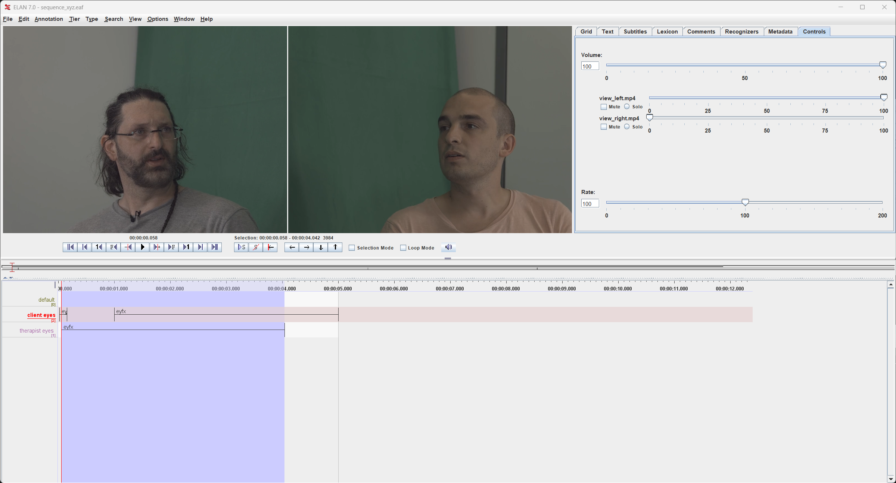
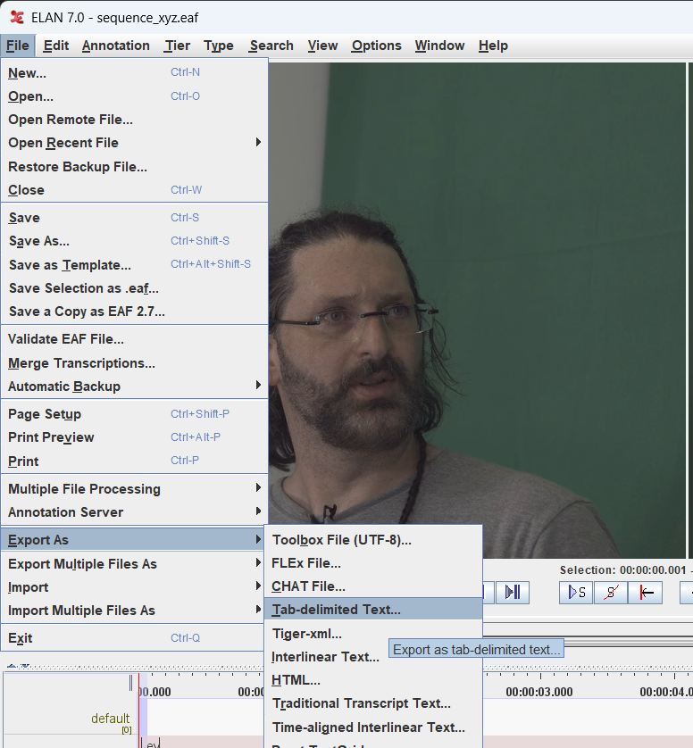
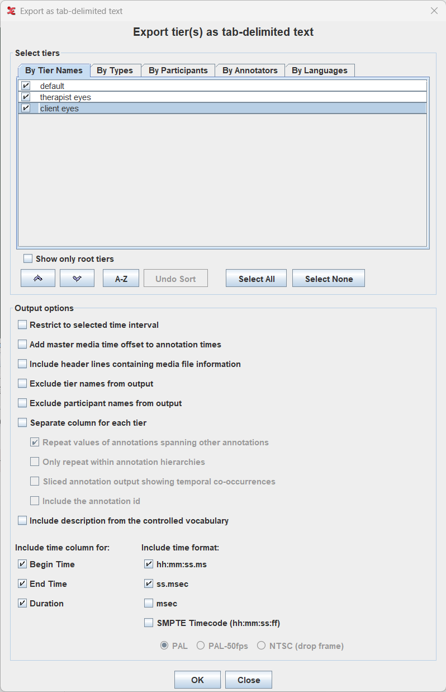

# ELAN Connector: Import Gaze Annotations

This tutorial shows how to import human-annotated gaze data from [ELAN](https://archive.mpi.nl/tla/elan) to use as ground truth for evaluating NICE Toolbox detector outputs.

<br>

1. [What is ELAN?](#1-what-is-elan)
2. [Prerequisites](#2-prerequisites)
3. [Prepare and export your annotations](#3-prepare-and-export-your-annotations)
    - [Tier naming and labels](#tier-naming-and-labels)
    - [Export as tab-delimited text](#export-as-tab-delimited-text)
4. [Configure the connector](#4-configure-the-connector)
    - [Top-level settings](#top-level-settings)
    - [Sequence settings](#sequence-settings)
    - [Subject mapping](#subject-mapping)
5. [Run the connector](#5-run-the-connector)
6. [Use the output for evaluation](#6-use-the-output-for-evaluation)

<br>


## 1. What is ELAN?

[ELAN](https://archive.mpi.nl/tla/elan) (EUDICO Linguistic Annotator) is a free annotation tool developed at the Max Planck Institute for Psycholinguistics. It is widely used in linguistics, psychology, and behavioral research for frame-accurate annotation of audio and video recordings. Download it for Linux, macOS, or Windows at [https://archive.mpi.nl/tla/elan/download](https://archive.mpi.nl/tla/elan/download) — no license required.

ELAN organizes annotations into **tiers** — named tracks that run along a shared video timeline. Each tier holds a sequence of **intervals**, where each interval has a start time, an end time, and a text label. Multiple tiers run in parallel, so each subject and behavior gets its own track.

In this tutorial, we use ELAN to label **gaze interaction** — whether each person is looking at their conversational partner or looking away. This produces frame-by-frame ground truth that can be compared against the NICE Toolbox gaze detector to measure its accuracy.

## 2. Prerequisites

- **ELAN** installed on your machine.
- **A video file** of your session to annotate.

The ELAN connector itself requires no additional installation — it is part of the standard NICE Toolbox environment.

Throughout this tutorial we use the `communication_multiview` example dataset. If you haven't set it up yet, follow the [Getting Started](../getting_started.md) guide first.


## 3. Prepare and export your annotations

### Open the example project

The `communication_multiview` example dataset includes a ready-made ELAN annotation file. Open it in ELAN via **File → Open**:

```
<datasets_folder_path>/communication_multiview/annotations_raw/gaze_elan/sequence_xyz.eaf
```

This opens the annotation alongside the two face-camera videos. You will see two tiers in the timeline — `client eyes` and `therapist eyes` — one for each participant.

If you are starting a new annotation from scratch, create the tiers via **Tier → Add New Tier**, naming them `<subject_id> eyes` for each participant.

### Tier naming and labels

Each subject needs one tier named `<subject_id> eyes` (e.g. `client eyes`, `therapist eyes`). The subject ID is the prefix before the space — it is what you will map to a toolbox name in the config later.

For each interval, use one of the two recognized labels:

| Label  | Meaning                                   |
|--------|-------------------------------------------|
| `eyfx` | Looking at the other person (fixed gaze)  |
| `eyga` | Gaze averted / not looking at partner     |

Intervals with no label are treated as gaps — you can configure a default label to fill them (see [Labeling categories](#labeling-categories)).

The final result of the labeling will looks something like this:


### Export as tab-delimited text

Once your annotation is complete, go to **File → Export As → Tab-delimited Text**:



In the export dialog, make sure:
- Both `client eyes` and `therapist eyes` tiers are checked under **By Tier Names**.
- **Include header lines containing media file information** is checked — this embeds the FPS and duration metadata that the connector uses for validation.



Click **OK**. The resulting `.txt` file is what you pass as `input` in the run config.


## 4. Configure the connector

The connector is driven by a single TOML config file. A template is provided at `configs/connectors/elan_import_gaze.toml`.

### Sequence settings

Each sequence is a table under `[run.<sequence_id>]`:

```toml
[run.sequence_xyz]
input        = "<dataset_folder>/annotations_raw/gaze_elan/sequence_xyz.txt"
output       = "<elan_output>/sequence_xyz_gaze.npz"
video        = "<dataset_folder>/sequence_xyz/view_top.mp4"
start        = 0       # from first frame
end          = -1      # until the end
reset_frames = true    # keep the frames order
```

| Field          | Description |
|----------------|-------------|
| `input`        | Path to the ELAN `.txt` export |
| `output`       | Where to save the output `gaze.npz` |
| `video`        | Video file — used to read FPS and validate alignment with ELAN header |
| `start` / `end` | Time window to extract, as `"HH:MM:SS"` or frame index |
| `reset_frames` | If `true`, output frame labels start at `000000000`; if `false`, they use the original video frame numbers |

You can define multiple sequences in the same config file by adding more `[run.<sequence_id>]` tables.

### Subject mapping

The `[subjects]` table maps ELAN tier subject IDs to toolbox subject names:

```toml
[subjects]
client   = "person_left"
therapist = "person_right"
```

The keys are the subject prefixes used in your ELAN tier names (e.g. `client` in `client eyes`). The values become the subject labels in the output NPZ.


## 5. Run the connector

Activate your NICE Toolbox environment and run:

```bash
# Linux
source ./envs/nicetoolbox/bin/activate

# Windows
envs\nicetoolbox\Scripts\activate

# Run the connector
elan_connector import_gaze
```

Progress and validation messages are printed to the console and written to the log file defined in the config.


## 6. Use the output for evaluation

The connector's primary use case is producing ground-truth annotation files that can be compared against NICE Toolbox detector outputs in the evaluation pipeline.

Once you have a `gaze.npz` from the connector, point the evaluation config at it as the ground-truth source. For example, in `configs/evaluation_config.toml`:

```toml
[metrics.gaze_accuracy]
metric_type   = "accuracy"
predictions   = { component = "gaze_individual", npz_key = "gaze_look_at_3d" }
ground_truth  = { path = "<output_folder_path>/connectors/elan_import/sequence_xyz_gaze.npz", npz_key = "gaze_look_at_3d" }
```

Before running the evaluation, make sure you have a completed detector run to compare against. If you haven't done that yet, run the detectors first (see [Getting Started](../getting_started.md#5-run-the-nice-toolbox)):

```bash
run_detectors
```

Then run the evaluation:

```bash
run_evaluation
```

The results are saved to the folder defined in `evaluation_config.toml` under `output_folder`. See [Tutorial 5](tutorial5_evaluation.md) for a full walkthrough of the evaluation pipeline.
