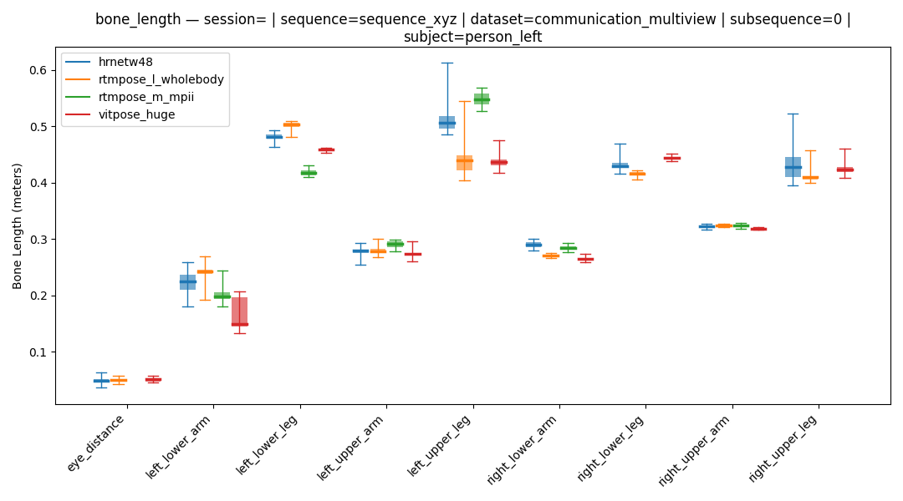
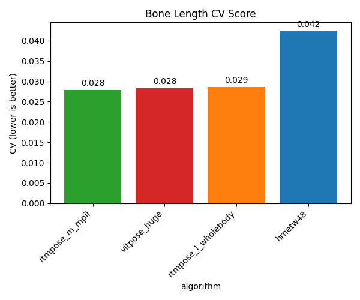
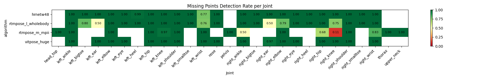
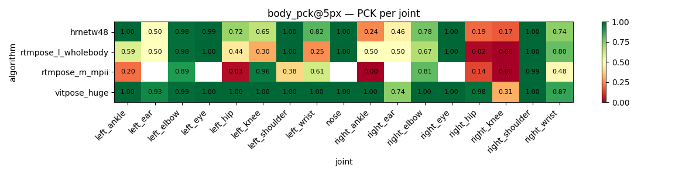
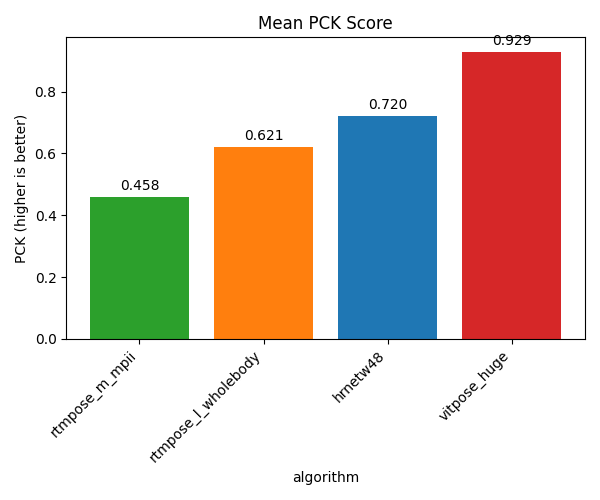
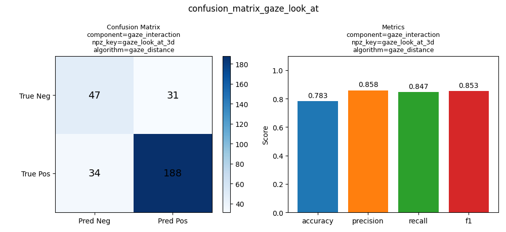
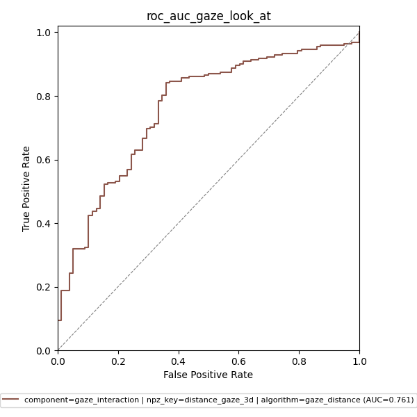
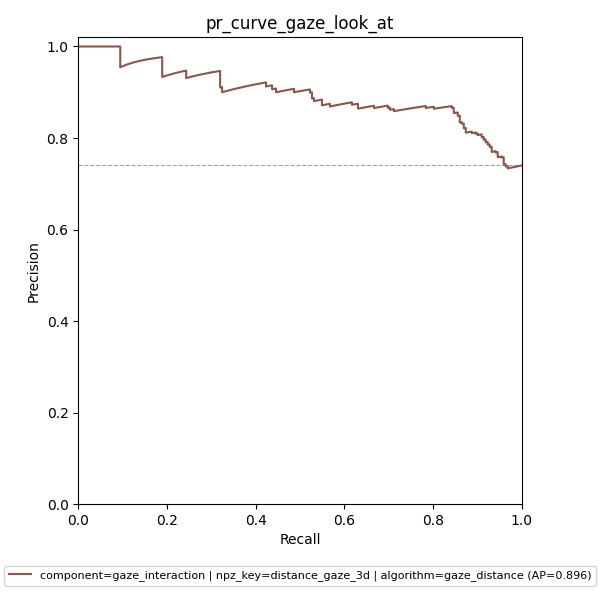

# Evaluation Metrics

The evaluation module measures the quality and consistency of detector outputs by running configurable metrics over your experiment's NPZ files. It produces CSV summary reports and visualisation plots, making it easy to compare algorithms across datasets, sessions, subjects, or individual joints. All metrics are defined in `./configs/evaluation_config.toml`; multiple named metric instances can run in a single pass.

```{contents} Contents
:depth: 3
```

## Available Metrics

### Bone Length

Measures how stable each bone's length is across all frames for each subject. Real bone lengths are constant, so high variance indicates tracking instability rather than actual movement. Stability is reported as the [coefficient of variation](https://en.wikipedia.org/wiki/Coefficient_of_variation) (CV = std / mean).

**Inputs:** 3D keypoint predictions. Bone definitions (which joint pairs form each bone) are read from `predictions_mapping.toml`.

**Key parameters:**
- **`predictions`**: which component and NPZ key to read — must be a 3D keypoint array
- **`summary_group_by`**: dimensions to break results down by
- **`summary_aggr`**: which statistical columns to include in the output CSV

```{warning}
Always include `"subject"` in `summary_group_by`. Bone lengths differ between people, so pooling across subjects produces meaningless variance estimates.
```

**Output — summary CSVs:** `coefficient_variation_score.csv` (one row per algorithm, aggregated across all groups) and `summary.csv` (full breakdown per `summary_group_by` dimensions). Columns depend on `summary_aggr`; common choices are `mean`, `std`, `cv` per bone. Check `cv` — **lower is better**.

**Output — NPZ arrays:** `bone_length` (per-frame length of each bone), `predictions` (raw 3D input used).

**Aggregation: macro** — `summary_aggr` functions are applied to the per-frame bone length values within each group independently.

```toml
[metrics.bone_length]
metric_type = "bone_length"
predictions = { component = "body_joints", npz_key = "3d" }
summary_group_by = ["subject", "sequence", "label"]
summary_aggr = ["mean", "std", "cv"]
```

The candle plot shows the distribution of each bone's length across all frames, grouped by algorithm. Tight boxes indicate stable tracking; wide boxes indicate high variance.

[](../graphics/eval_bone_length_candle.png)

The CV score bar summarises tracking stability per algorithm across all bones — lower is better.

[](../graphics/eval_bone_length_cv_score.png)

---

### Missing Points

Counts joints that are absent or unreliable per frame. A joint is considered missing if any of its spatial coordinates is NaN, or if its confidence score falls below an optional threshold.

**Inputs:** 2D or 3D keypoint predictions.

**Key parameters:**
- **`predictions`**: component and NPZ key to evaluate
- **`min_confidence`** *(optional)*: float threshold on the confidence coordinate; joints below this value are treated as missing (e.g. `0.5`)
- **`missing_points_summary_group_by`**: grouping dimensions
- **`missing_points_summary_aggr`**: aggregation functions for the output CSV

**Output — summary CSVs:** `detection_rate_score.csv` (one row per algorithm, aggregated across all groups) and `summary.csv` (full breakdown per `missing_points_summary_group_by` dimensions). Columns depend on `missing_points_summary_aggr`; common choice is `detection_rate` (= 1 − missing rate). Check `detection_rate` — **higher is better**.

**Output — NPZ arrays:** `missing` (binary flag per joint per frame — 1 if missing, 0 if detected), `detected_pct` (fraction of joints detected per frame), `confidence` (raw confidence values), `predictions` (raw input used).

**Aggregation: macro** — `missing_points_summary_aggr` functions are applied to the per-frame missing flags within each group independently.

```toml
[metrics.missing_points_3d]
metric_type = "missing_points"
predictions = { component = "body_joints", npz_key = "3d" }
missing_points_summary_group_by = []
missing_points_summary_aggr = [
    { name = "total_count",    fn = "count" },
    { name = "miss_count",     fn = "sum" },
    { name = "detection_rate", fn = "one_minus_mean" }
]
```

The heatmap shows the detection rate per joint per algorithm. White cells indicate joints not tracked by that algorithm; red indicates frequent misses.

[](../graphics/eval_missing_points_heatmap.png)

---

### PCK — Percentage of Correct Keypoints

A keypoint is *correct* if it exists (non-NaN) and its distance to the ground-truth position is within `threshold` pixels. The metric reports the fraction of correct keypoints.

**Inputs:** 2D keypoint predictions + ground-truth keypoint annotations.

**Key parameters:**
- **`threshold`**: distance threshold in pixels — strict values (e.g. `5px`) penalise small errors; lenient values (e.g. `20px`) tolerate more imprecision
- **`predictions`**: component and NPZ key for the predictions
- **`ground_truth`**: component and NPZ key for annotations, with `source = "annotation"` to indicate this is not a detector output

**Output — summary CSVs:** `pck_score.csv` (one row per algorithm, aggregated across all groups) and `summary.csv` (full breakdown per `summary_group_by` dimensions). Common columns: `pck` (fraction of keypoints within the distance threshold), `correct_count` (number of correct keypoints), `support` (total number of keypoints evaluated). Check `pck` — **higher is better**.

**Output — NPZ arrays:** `pck` (per-frame per-joint correctness flag — 1.0 if correct, 0.0 if incorrect or missing), `predictions` (aligned predictions), `ground_truth` (aligned GT annotations).

**Aggregation: macro** — `summary_aggr` functions (e.g. `mean`) are applied to the per-frame correctness flags within each group independently.

```toml
[metrics."body_pck@5px"]
metric_type = "pck"
threshold = 5
predictions = { component = "body_joints", npz_key = "2d_interpolated" }
ground_truth = { source = "annotation", component = "body_joints", npz_key = "2d" }
summary_group_by = ["label"]
summary_aggr = [
    { name = "pck",           fn = "mean"  },
    { name = "correct_count", fn = "sum"   },
    { name = "support",       fn = "count" }
]
```

The heatmap shows PCK per joint per algorithm at the configured threshold. The score bar shows the mean PCK across all joints per algorithm.

[](../graphics/eval_pck_heatmap.png)
[](../graphics/eval_pck_score.png)

---

### Distance Error

Computes the direct per-joint distance between predicted and ground-truth positions using either the [L2 (Euclidean)](https://en.wikipedia.org/wiki/Euclidean_distance) or [L1 (Manhattan)](https://en.wikipedia.org/wiki/Taxicab_geometry) norm. Unlike PCK, this does not apply a threshold — it gives the raw error value.

**Inputs:** 2D or 3D keypoint predictions + ground-truth keypoint annotations.

**Key parameters:**
- **`norm`**: `"l2"` (default) or `"l1"`
- **`predictions`** / **`ground_truth`**: component and NPZ key

**Output — summary CSVs:** `mean_error_score.csv` (one row per algorithm, aggregated across all groups) and `summary.csv` (full breakdown per `summary_group_by` dimensions). Columns depend on `summary_aggr`; common choices are `mean`, `std`, `min`, `max` per joint. Check `mean` — **lower is better**.

**Output — NPZ arrays:** `distance_error` (per-frame per-joint distance to ground truth), `predictions` (aligned predictions), `ground_truth` (aligned GT annotations).

**Aggregation: macro** — `summary_aggr` functions are applied to the per-frame distance values within each group independently.

---

### Confusion Matrix

For binary (True/False) prediction arrays, computes a [confusion matrix](https://en.wikipedia.org/wiki/Confusion_matrix) and derives precision, recall, F1, and accuracy. All frames within each group are pooled before computing the matrix — see [Micro and Macro Aggregation](#micro-and-macro-aggregation) for details.

**Inputs:** Boolean prediction array + boolean ground-truth annotation array.

**Key parameters:**
- **`predictions`** / **`ground_truth`**: component and NPZ key (must contain boolean values)
- **`compute_group_by`**: dimensions used to pool frames before computing the matrix

**Output — summary CSV:** `summary.csv` with columns `tp`, `fp`, `fn`, `tn`, `accuracy`, `precision`, `recall`, `f1`, `support` — one row per `compute_group_by` group.

**Output — NPZ arrays:** `predictions` (aligned boolean predictions), `ground_truth` (aligned boolean GT labels).

**Aggregation: micro** — all frames within each `compute_group_by` group are pooled into a single pool first, then the confusion matrix is computed once on that pool. A larger group has proportionally more weight than a smaller one.

```toml
[metrics.confusion_matrix_gaze]
metric_type = "confusion_matrix"
predictions = { component = "gaze_interaction", npz_key = "gaze_look_at_3d" }
ground_truth = { source = "annotation", component = "gaze_interaction", npz_key = "gaze_look_at_3d" }
compute_group_by = []
```

The visualisation shows the confusion matrix alongside derived accuracy, precision, recall, and F1 scores.

[](../graphics/eval_confusion_matrix.png)

---

### ROC AUC

Computes the [Receiver Operating Characteristic (ROC)](https://en.wikipedia.org/wiki/Receiver_operating_characteristic) curve and the Area Under the Curve (AUC) by sweeping all possible decision thresholds. AUC measures how well the model ranks positives above negatives regardless of the chosen threshold. Also reports the optimal threshold via Youden's J statistic (maximises TPR − FPR). Suitable when predictions are continuous scores rather than hard boolean decisions.

**Inputs:** Float confidence scores (predictions) + boolean ground-truth labels.

**Key parameters:**
- **`predictions`** / **`ground_truth`**: component and NPZ key
- **`negate_scores`**: set `true` when a *lower* score indicates a positive — for example, a gaze distance metric where a smaller distance means "looking at"
- **`compute_group_by`**: dimensions used to pool frames before computing the curve

**Output — summary CSV:** `summary.csv` with columns `auc`, `optimal_threshold`, `support` — one row per `compute_group_by` group. Check `auc` — **higher is better** (1.0 = perfect, 0.5 = random).

**Output — NPZ arrays:** `predictions` (aligned float scores), `ground_truth` (aligned boolean GT labels).

**Aggregation: micro** — all frames within each `compute_group_by` group are pooled first, then the ROC curve and AUC are computed once on that pool.

```toml
[metrics.roc_auc_gaze]
metric_type = "roc_auc"
predictions = { component = "gaze_interaction", npz_key = "distance_gaze_3d" }
ground_truth = { source = "annotation", component = "gaze_interaction", npz_key = "gaze_look_at_3d" }
negate_scores = true  # larger distance = not looking
compute_group_by = []
```

[](../graphics/eval_roc_auc.png)

---

### PR Curve — Average Precision

Computes the [Precision-Recall curve](https://en.wikipedia.org/wiki/Precision_and_recall) and the Average Precision (AP) score by sweeping decision thresholds. AP is often preferred over ROC AUC when positive and negative classes are heavily imbalanced, because it focuses on the positive class. Also reports the decision threshold that maximises F1 across the curve.

**Inputs:** Float confidence scores (predictions) + boolean ground-truth labels.

**Key parameters:**
- **`predictions`** / **`ground_truth`**: component and NPZ key
- **`negate_scores`**: same meaning as in ROC AUC
- **`compute_group_by`**: dimensions used to pool frames

**Output — summary CSV:** `summary.csv` with columns `ap`, `optimal_threshold`, `support`, `prevalence` — one row per `compute_group_by` group. Check `ap` — **higher is better**.

**Output — NPZ arrays:** `predictions` (aligned float scores), `ground_truth` (aligned boolean GT labels).

**Aggregation: micro** — all frames within each `compute_group_by` group are pooled first, then the PR curve and AP are computed once on that pool.

```toml
[metrics.pr_curve_gaze]
metric_type = "pr_curve"
predictions = { component = "gaze_interaction", npz_key = "distance_gaze_3d" }
ground_truth = { source = "annotation", component = "gaze_interaction", npz_key = "gaze_look_at_3d" }
negate_scores = true
compute_group_by = []
```

[](../graphics/eval_pr_curve.png)

---

## Aggregation

### Aggregation Functions

The `summary_aggr` parameter selects which statistical columns appear in the output CSV. You can either list function names directly (the column name will match the function) or provide custom column names via `{ name = "...", fn = "..." }`.

| Function | Description |
| - | - |
| `mean` | Average value |
| `std` | Standard deviation |
| `min` / `max` | Minimum / maximum |
| `sum` | Total — useful for counting correct frames |
| `count` | Number of samples (total frames evaluated) |
| `median` | 50th percentile |
| `q25` / `q75` / `q90` | 25th / 75th / 90th percentile |
| `cv` | Coefficient of variation (std / mean) |
| `one_minus_mean` | 1 − mean — use to report detection rate instead of missing rate |

```toml
# shorthand: column name matches function name
summary_aggr = ["mean", "std", "cv"]

# custom column names
summary_aggr = [
    { name = "detection_rate", fn = "one_minus_mean" },
    { name = "support",        fn = "count" }
]
```
